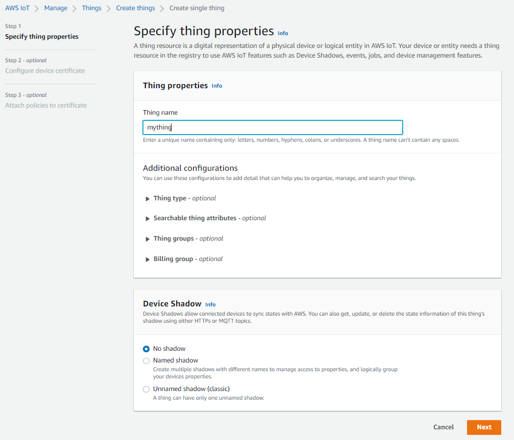

# Mendix AWS IoT Bonus

If you're streaking ahead, you can always try out the bonus activity

This activity is an extension of the following workshop: https://github.com/mxcrawford/Mendix-AWS-Rekognition

- [Mendix AWS IoT Bonus](#mendix-aws-iot-bonus)
- [Bonus 1](#bonus-1)
  - [Change your app and use it to detect celebrity faces!](#change-your-app-and-use-it-to-detect-celebrity-faces)
- [Bonus 2](#bonus-2)
  - [Publish messages using AWS IoT Core & MQTT](#publish-messages-using-aws-iot-core--mqtt)
    - [Setup your IoT Core thing](#setup-your-iot-core-thing)
    - [Build for Publishing messages](#build-for-publishing-messages)
    - [Test your publishing](#test-your-publishing)
    - [Build for Subscribe](#build-for-subscribe)
    - [Test Subscribe](#test-subscribe)
# Bonus 1

## Change your app and use it to detect celebrity faces!

You will need to do a few things:
1. Train a new model with some celebrity faces
2. Update the Nanoflow "TakePicture" to use your new model
3. If you want, update your UI to tell the User which Celebrity is in the picture

# Bonus 2

## Publish messages using AWS IoT Core & MQTT

With Mendix you can also very easily connect your IoT devices using AWS's IoT Core, this set of steps will help you to publish and subscribe to IoT devices using the MQTT protocol

### Setup your IoT Core thing

1. Setup an MQTT thing in [IoT Core](https://console.aws.amazon.com/iot/home)


2. Select a Single thing
   


1. Enter the name



2. We recommend "Auto-generate a new certificate"


3. Attach a policy

We'll assume you do not have a Policy in place, so for this build you can just use an "Allow all" policy (This is to keep things simple but is NOT recommended for production)

You can enter the Policy in JSON from as below:

```
{
  "Version": "2012-10-17",
  "Statement": [
    {
      "Effect": "Allow",
      "Action": "iot:*",
      "Resource": "*"
    }
  ]
}
```

If you are wanting to use this in a more secure way, you can use the below format for your policy. See more about IoT Core Policies [here](https://docs.aws.amazon.com/iot/latest/developerguide/iot-policies.html)

Make sure to replace **<INSERT_REGION>** with your region e.g. **eu-central-1**

Make sure to replace **<INSERT_ACCOUNT_ID>** with your account id e.g. **999999999999**

```
{
  "Version": "2012-10-17",
  "Statement": [
    {
      "Effect": "Allow",
      "Action": "iot:Connect",
      "Resource": "arn:aws:iot:<INSERT_REGION>:<INSERT_ACCOUNT_ID>:*"
    },
    {
      "Effect": "Allow",
      "Action": "iot:Publish",
      "Resource": "arn:aws:iot:<INSERT_REGION>:<INSERT_ACCOUNT_ID>:*"
    },
    {
      "Effect": "Allow",
      "Action": "iot:Receive",
      "Resource": "arn:aws:iot:<INSERT_REGION>:<INSERT_ACCOUNT_ID>:*"
    },
    {
      "Effect": "Deny",
      "Action": "iot:GetRetainedMessage",
      "Resource": "arn:aws:iot:<INSERT_REGION>:<INSERT_ACCOUNT_ID>:*"
    },
    {
      "Effect": "Deny",
      "Action": "iot:ListRetainedMessages",
      "Resource": "arn:aws:iot:<INSERT_REGION>:<INSERT_ACCOUNT_ID>:*"
    },
    {
      "Effect": "Allow",
      "Action": "iot:RetainPublish",
      "Resource": "arn:aws:iot:<INSERT_REGION>:<INSERT_ACCOUNT_ID>:*"
    },
    {
      "Effect": "Allow",
      "Action": "iot:Subscribe",
      "Resource": "arn:aws:iot:<INSERT_REGION>:<INSERT_ACCOUNT_ID>:*"
    },
    {
      "Effect": "Deny",
      "Action": "iot:DeleteThingShadow",
      "Resource": "arn:aws:iot:<INSERT_REGION>:<INSERT_ACCOUNT_ID>:*"
    },
    {
      "Effect": "Deny",
      "Action": "iot:GetThingShadow",
      "Resource": "arn:aws:iot:<INSERT_REGION>:<INSERT_ACCOUNT_ID>:*"
    },
    {
      "Effect": "Deny",
      "Action": "iot:UpdateThingShadow",
      "Resource": "arn:aws:iot:<INSERT_REGION>:<INSERT_ACCOUNT_ID>:*"
    },
    {
      "Effect": "Deny",
      "Action": "iot:UpdateThingShadow",
      "Resource": "arn:aws:iot:<INSERT_REGION>:<INSERT_ACCOUNT_ID>:*"
    },
    {
      "Effect": "Deny",
      "Action": "iot:DescribeJobExecution",
      "Resource": "arn:aws:iot:<INSERT_REGION>:<INSERT_ACCOUNT_ID>:*"
    },
    {
      "Effect": "Deny",
      "Action": "iot:GetPendingJobExecutions",
      "Resource": "arn:aws:iot:<INSERT_REGION>:<INSERT_ACCOUNT_ID>:*"
    },
    {
      "Effect": "Deny",
      "Action": "iot:UpdateJobExecution",
      "Resource": "arn:aws:iot:<INSERT_REGION>:<INSERT_ACCOUNT_ID>:*"
    },
    {
      "Effect": "Deny",
      "Action": "iot:StartNextPendingJobExecution",
      "Resource": "arn:aws:iot:<INSERT_REGION>:<INSERT_ACCOUNT_ID>:*"
    }
  ]
}
```

4. Create thing & Download Certs

Your thing will now be created. **Make sure to download all of the required certificate & key files**


### Build for Publishing messages

1. To explore the Mendix Marketplace and download the MQTT Connector


4. Connect the MQTT Config page provided up to the **Navigation**  

The Navigation inside Mendix Studio Pro allows you to configure a Navigation/Menu system for your users inside the application


You can now RUN your Mendix App using the Play icon


5. Configure your MQTT using the device information you created in **IoT Core**


* Select a Name for your configuration (it can be anything)
* Enter the Broker Host - in this case you can copy it from the AWS Console in the IoT Core configuration, see below:


* Port: 8883
* Authentication Method: NONE
* Timeout: 30
* Keep alive time: 60
* Clean session: No
* Auth reconnect: Yes
* SSL: Enabled
* Enter the respective certificates & keys from the files you have downloaded, see below:

Final result:


6. Test MQTT

* Log into the AWS Console inside [IoT Core](https://console.aws.amazon.com/iot/home)
* Open MQTT Test Client
* Click on the "Subscribe to a Topic" tab
* Enter the ```#``` symbol - this will subscribe you too any and ALL of the messages being published on any of your IoT things
* Click on the "Publish to a Topic" tab - you will see a section below showing any messages based on your ```#``` subscription
* In the publish section enter a Topic e.g. we will use ```things/comments/```
* In the Message Payload section you can leave this as it is or change it
* Click Publish
* You should now see your message show up below

- [Mendix AWS IoT Bonus](#mendix-aws-iot-bonus)

1. Create an Entity in the Domain model that is NON-PERSISTENT Called **Comment** 
2. Add an attribute to that entity that can store a String attribute **Message**


3.  Create a DSO Nanoflow like we did in the Rekognition project that CREATES and RETURNS an instance of the **Comment** Entity


4.  Place a **Data View** on the **Home_IoT_Start** start page and select the new DSO (Data Source) Nanoflow as the data source
5.   Add a text box widget from the **Toolbox** that can help capture the message attribute
6.   Add a **Microflow** button inside the **Data View** in order to send the message
7.   Behind the Microflow button, create a new Microflowm to send the message
8.   In the Microflow, drag on a **Retrieve** activity from the **Toolbox** the IoT Config From the database


1.  Now drag on a **Export with mapping** activity from the **Toolbox**
2.  In this Export activity, Select a mapping, and click on **New** to create a new one


16. Open the new mapping, click on **Select Elements** at the top
17. Select **JSON Structure**
18. Click **Select** and create a new JSON mapping
19. Enter the following simple JSON structure

```
{
	"Message": "Hello World!"
}
```
20. Click Refresh and OK
21. Inside the mapping you can automatically map your Mendix **Comment** Entity to the JSON structure by selecting, **Map Automatically** at the top
22. Once the mapping is done, inside your Microflow, in the Export mapping activity, select your Comment object as a Paramenter and click OK
23. Select the output for the export mapping to be a String
24. Use the **Toolbox** to drag on the **Publish MQTT** activity
25. Fill in the details of the MQTT, use the topic:
```
things/comments
```
26. Use the Output JSON String from the export as the **Payload**
27. Select QoS as "At least once"
28. Set Retained to true

Your Microflow should be complete, you can run the project locally by using the **Green** run button at the top (left of the publish button)

You should be able to log into the AWS IoT Core console, and subscribe to your topic to test the messages

### Test your publishing

### Build for Subscribe

### Test Subscribe
